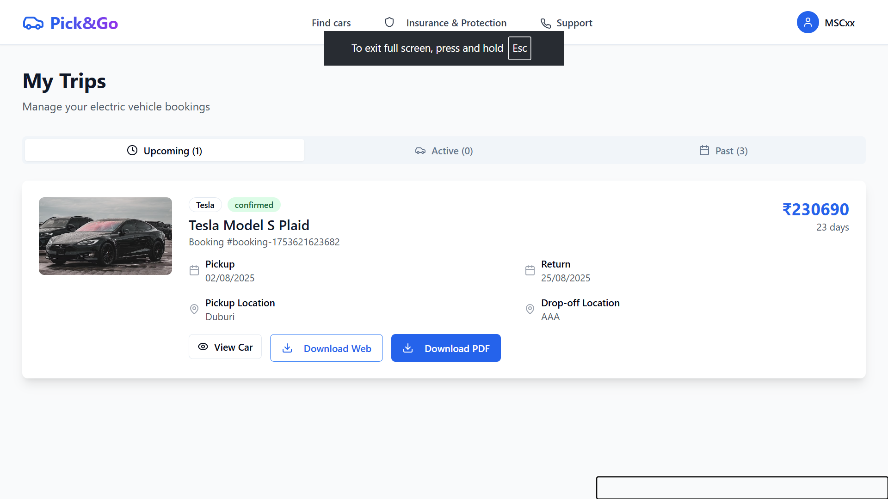

# 🛺 Pick‑Go

A full-featured, responsive **MERN Stack** application for booking and managing electric vehicle (EV) trips.

Built using **MongoDB**, **Express**, **React**, **Node.js**, styled with **TailwindCSS**, and secured via **JWT Authentication**.

---

## 🌐 Live Demo

🔗 [Click to Visit: Pick-Go Live](https://pick-go-rho.vercel.app)

---

## 🚀 Features

- 🔐 User Registration & Login (JWT)
- 🔍 Browse, filter, and select EVs
- 📅 Book trips with date pickers
- 📋 View dashboard of all bookings (past, upcoming, current)
- 📄 Download trip receipts (PDF & HTML)
- 🛠 Admin panel for EV/user management
- 🔔 Toast notifications for actions

---

## 🧑‍💻 Tech Stack

| Layer     | Technologies |
|-----------|--------------|
| Frontend  | React, React Router, Tailwind CSS |
| Backend   | Node.js, Express.js, JWT, bcrypt |
| Database  | MongoDB Atlas |
| UI Lib    | Radix UI / ShadCN, Lucide Icons |
| Toast     | Custom Hook + Toast UI |
| Storage   | LocalStorage (tokens, data) |
| PDF Tool  | `html2pdf.js`, `jsPDF` |

---

## 📸 Screenshots

### 🏠 Home Page

<p float="left">
  
  
  
  
</p>

### 🔐 Authentication

<p float="left">
  
  
</p>

### 🛍️ Shop / Product Pages

<p float="left">
  
  
  
</p>

### 🧾 Booking & Trip Dashboard

<p float="left">
  
  
  
  
</p>

### 👤 Profile & Settings

<p float="left">
  
  
  
</p>

### 🛠 Admin Panel

<p float="left">
  
  
  
  
  
</p>

### 💬 Support Page

<p float="left">
  
</p>

---

## 📦 Installation & Setup

### 1. Clone the Repository

```bash
git clone https://github.com/MSC-0013/Pick-Go.git
cd Pick-Go

2. Configure Environment Variables
Backend – /server/.env

MONGO_URI=your_mongodb_uri
JWT_SECRET=your_jwt_secret
PORT=5000

Frontend – /client/.env

REACT_APP_API_URL=http://localhost:5000/api


3. Run the App
Start Backend


cd server
npm install
npm run dev


Start Frontend

cd client
npm install
npm run dev


🧪 Usage Guide
Register or log in as a user

Browse available electric vehicles

Select trip dates & confirm booking

Manage all your trips from the dashboard

Download trip receipts

If admin, manage users & EVs

🔐 Security & Auth
Passwords hashed via bcrypt

Auth handled via JWT tokens

Protected API routes with middleware

Frontend route guards and validation

✨ Suggested Improvements
🔁 Integrate Razorpay or Stripe for payments

📸 Add real vehicle images

🗓 Improve calendar UX with better date pickers

🌍 Add internationalization (i18n)

🧠 Add ML-based vehicle suggestions

🤝 Contributing
Contributions are welcome!
Submit a PR, open an issue, or suggest a new feature.

📂 Optional Enhancements
📸 All screenshots are placed in the /screenshots/ folder

📃 API documentation can go inside /docs/

🚀 Deployment via Vercel (Frontend) & Render/Heroku (Backend)

🪪 License
This project is licensed under the MIT License

